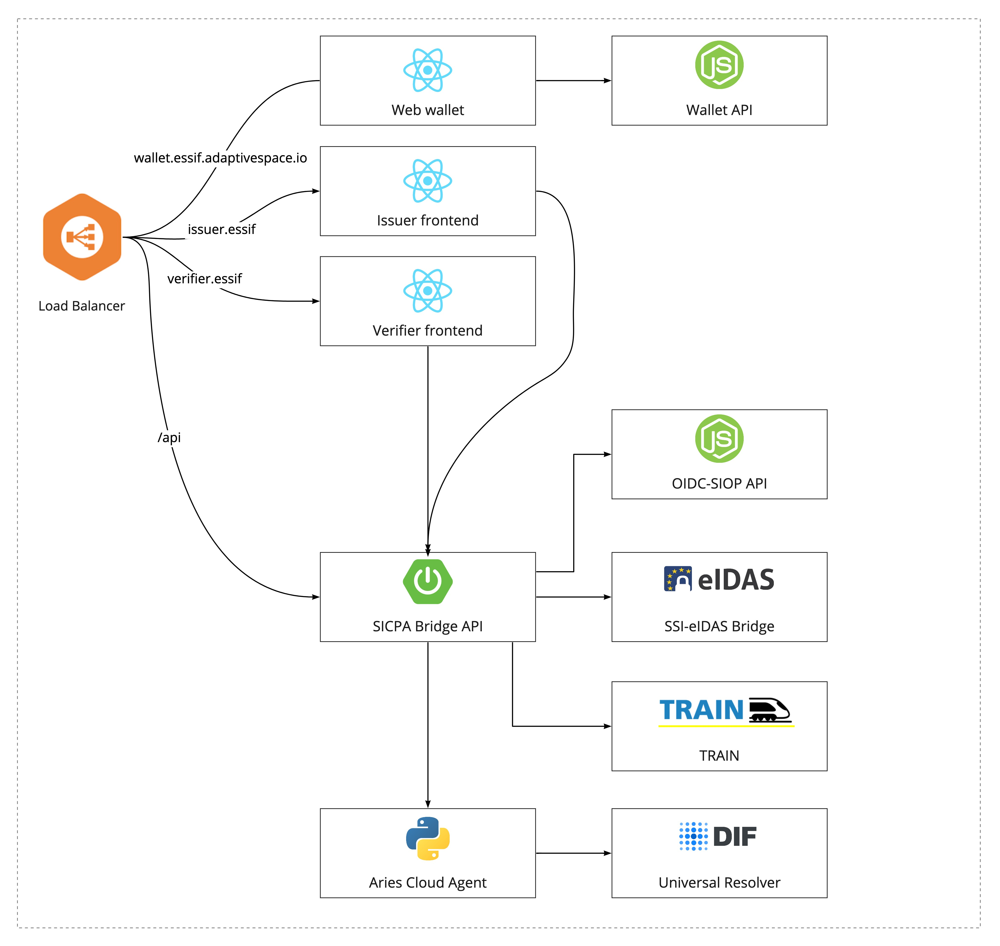

Sicpa Bridge
======

This repo contains codebase of [Sicpa Bridge project](https://gitlab.grnet.gr/essif-lab/infrastructure/sicpa/bridge_project_summary).

A live demo of the European Health Insurance Card (EHIC) use-case powered by **SICPA bridge** is available at [Sicpa Bridge EHIC demo.](https://essif.adaptivespace.io/)


### Content of the repo

```
├── ..
├── README.md               # this file
├── backend                 # Spring Boot application - Bridge API
├── deployment              # Deployment to AWS ECS via Github Actions
├── docs                    # Doc assets
├── frontend                # Issuer and Verifier frontend app
├── oidc-siop-backend       # OIDC-SIOP backend API
├── ..
```

### Solution Diagram




### Building blocks

* [Hyperledger Aries Cloud Agent - Python](https://github.com/hyperledger/aries-cloudagent-python) configure with Sicpa´s [Plugin for HTTP Universal Resolver bindings](https://github.com/sicpa-dlab/acapy-resolver-universal). The image is also available on Docker Hub [rdlabbridge/aries-cloudagent:tagname](https://hub.docker.com/repository/docker/rdlabbridge/aries-cloudagent). [Dockerfile](deployment/aca-py-universal-resolver/Dockerfile) available in deployment folder.
* [SICPA browser-based wallet](https://wallet.essif.adaptivespace.io/)


### Interoperability dependencies

* [SSI eIDAS Bridge](https://gitlab.grnet.gr/essif-lab/infrastructure/validated-id/seb_project_summary)
* [TRAIN](https://gitlab.grnet.gr/essif-lab/infrastructure/fraunhofer/train_project_summary)

### Configuration

#### Frontend

All [Frontend](frontend/README.md) apps can be configured via ```.env``` file.
```
# Websocket url
REACT_APP_WEBSOCKET_URL=wss://essif.adaptivespace.io/api/bridge-websocket
# Bridge API url
REACT_APP_BRIDGE_API_URL=https://essif.adaptivespace.io/api
```

#### Backend via spring bot application.yaml
```
# Aries Cloud Agent Admin API
aca-py-client:
  url: http://essif.adaptivespace.io:8080

# OIDC-SIOP API
oicd-client:
  url: http://essif.adaptivespace.io:3000/api

# TRAIN API
train:
  url: http://atvtrain3-env.eba-gewjbrmq.eu-central-1.elasticbeanstalk.com
  #url: https://essif.trust-scheme.de/atvtrain

# EIDAS Bridge API
eidas-bridge:
  url: https://api.vidchain.net
  certificatePassword: 1234
```
